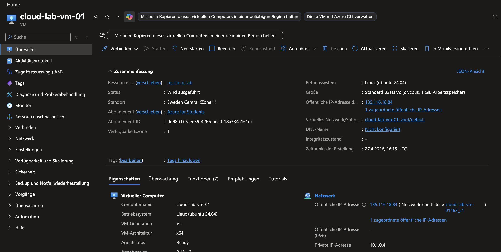
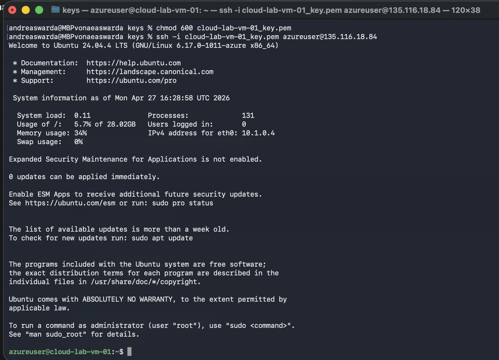
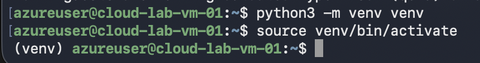
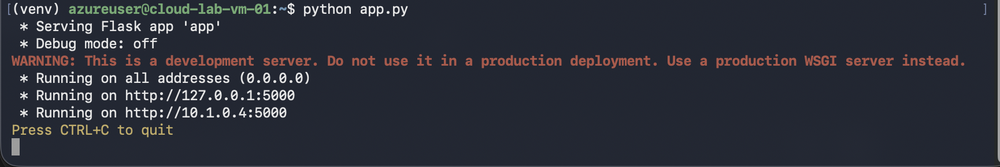
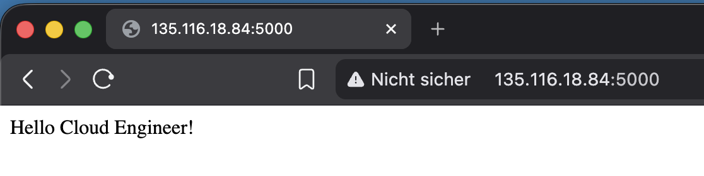

# Azure VM Flask App

## Überblick
In diesem Projekt wurde eine Linux VM in Azure erstellt und eine einfache Python Web-App mit Flask bereitgestellt.

---

## Architektur
- Azure Virtual Machine (Ubuntu)
- SSH Zugriff
- Python (venv)
- Flask Webserver
- Port 5000 freigegeben (NSG)

---

## 1. VM erstellen
- Ressourcengruppe: rg-cloud-lab
- VM Name: cloud-lab-vm-01
- OS: Ubuntu

---

## 2. Verbindung per SSH

```bash
ssh -i key.pem azureuser@<public-ip>
```

---

## 3. Python Umgebung

```bash
python3 -m venv venv
source venv/bin/activate
```

---

## 4. Flask installieren

```bash
pip install flask
```

---

## 5. App erstellen und starten

```bash
python app.py
```

---

## 6. Port freigeben
- Port 5000 in Azure NSG geöffnet

---

## 7. Zugriff im Browser

```
http://<public-ip>:5000
```

---

## Ergebnis

Die Anwendung ist öffentlich erreichbar und liefert:

```
Hello Cloud Engineer!
```

---

## Screenshots

  
  
  
  

